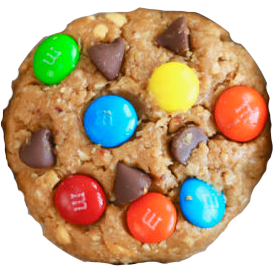

### Cookie Clicker 

It is a team project realized in 3 days.

### The team :

1. [Jean-Charles Brognez](https://github.com/jcbrognez)
2. [mohamed Shmayssany](https://github.com/M-Shmayssany)
3. [Adrien Delpire](https://github.com/osimers1)
4. [Robby Delvaux](https://github.com/Delvaux1986) 

# Objectives :

**Team Project javascript Aka Cookie Clicker**

[To Do List](https://github.com/becodeorg/CRL-Woods-3.21/blob/master/LearningPath/02.The-Hill/11.Javascript/03.JS-Challenges/cookie-clicker/README.md)
1. Make base structure in HTML, CSS and Javascript. Button in HTML which increments a counter initialized at 0.
2. Prepare Javascript and variables.
3. Increase score if clicking, stock score and display it.
4. Create multiplier with other button.
5. Add price to multiplier. When called, permanently multiplies received points when clicking.
6. No credit allowed (no negative score allowed).
7. Display of the counter and the multiplier.
8. Increase cost of multiplier each time user buys one.
9. Display cost in button.
10. Add an auto-clicker.
11. Add extra improvement button with a timer.
12. Disable buttons if user doesn't have enough points to buy an improvement.
13. Make it pretty with CSS and javascript

